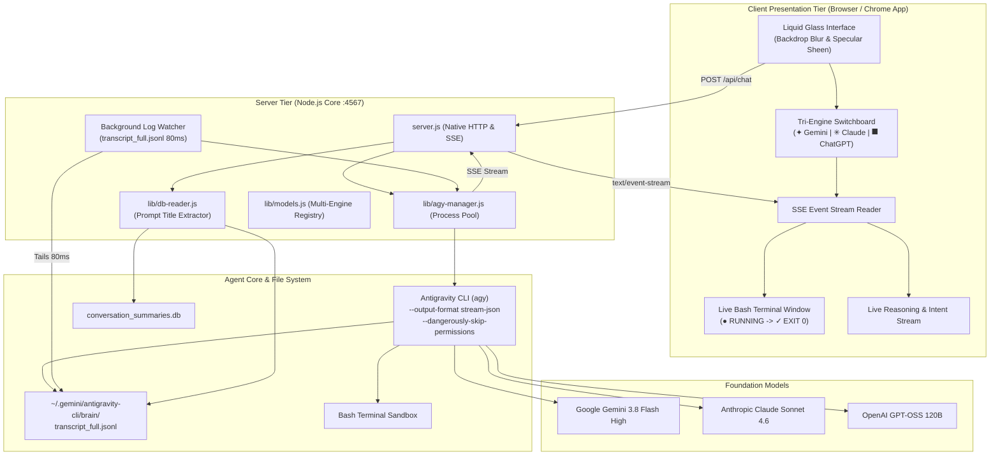
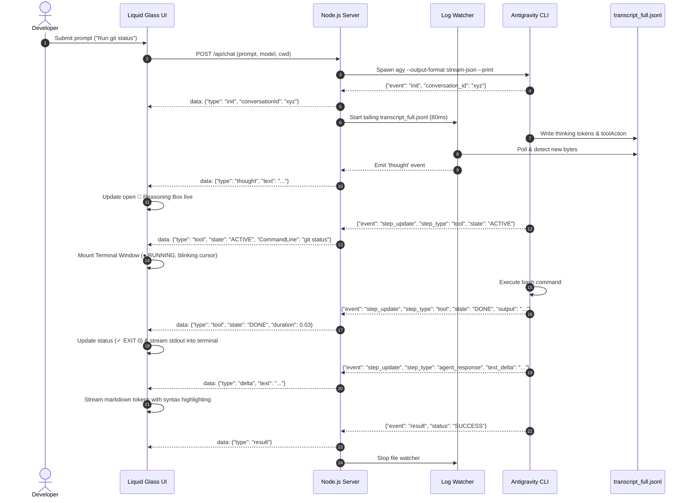

# 📐 Aether Code — System Architecture & Design

  

## Overview

**Aether Code** is designed around a three-tier decoupled architecture:
1. **Presentation Tier (Client)**: Apple Liquid Glass Material interface, tri-engine switchboard, real-time bash terminal window, and SSE stream consumer.
2. **Server Tier (Node.js Core)**: Zero-dependency runtime handling process pooling, transcript watcher (80ms poll), and SQLite/Brain title resolution.
3. **Engine & Foundation Tier**: The underlying Antigravity CLI subprocess (`agy`) executing tools, recording transcripts, and calling foundation models (Google Gemini, Anthropic Claude, OpenAI ChatGPT).

---

## 🏗️ Component Diagram (Mermaid)

---

## 🔄 Turn Execution & Real-Time Dataflow

---

## Key Design Principles

1. **True Observability**: Commands executed by the agent are not abstracted away or hidden behind static loaders. Each tool invocation creates an authentic terminal session with exact commands, status codes, and outputs.
2. **Zero Dependencies**: Standard Node.js (`http`, `sqlite`, `child_process`, `readline`) eliminates fragile npm dependency chains and vulnerabilities.
3. **Prompt-Derived Semantics**: Conversation session names are dynamically derived from user request semantics rather than randomized GUIDs.
4. **Adaptive Backdrops**: Apple Liquid Glass styling leverages SVG optical displacement maps and CSS hardware-accelerated filters.
